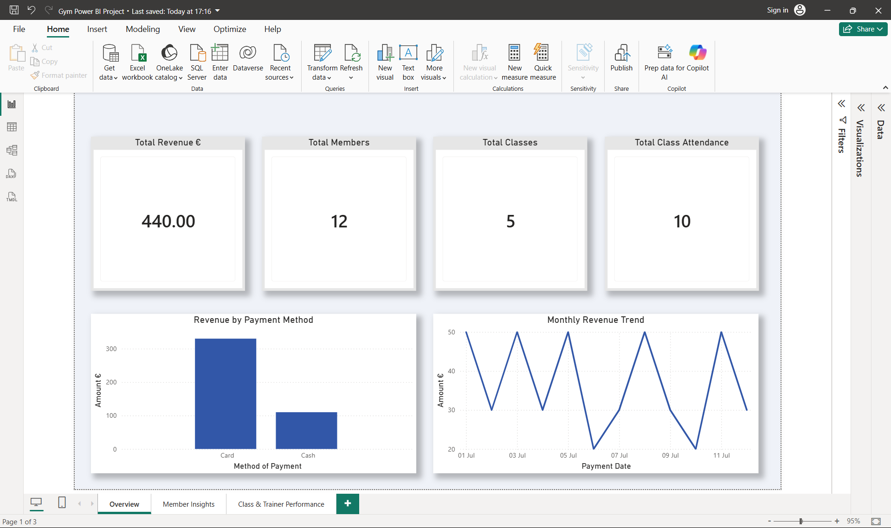
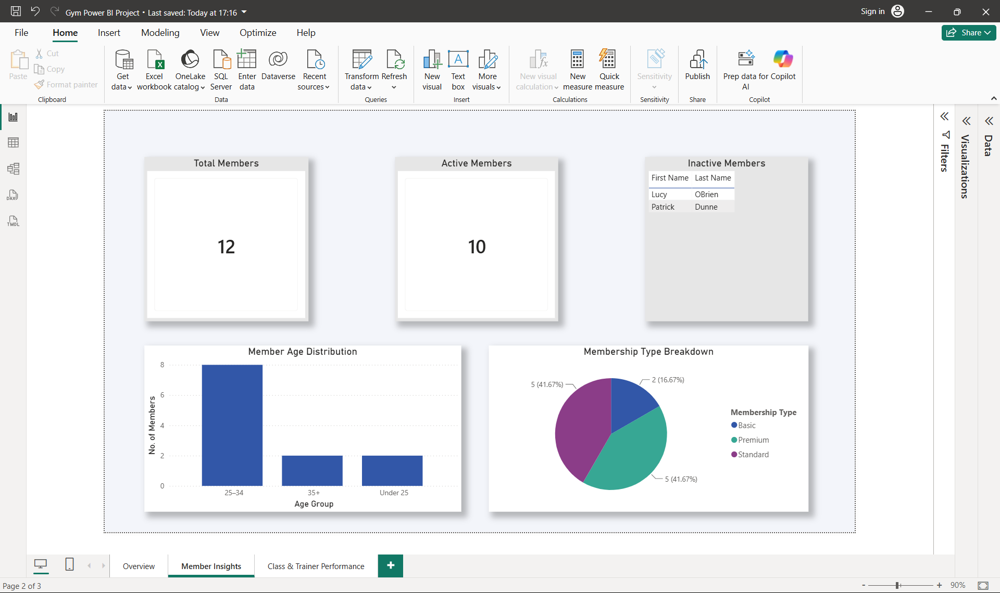
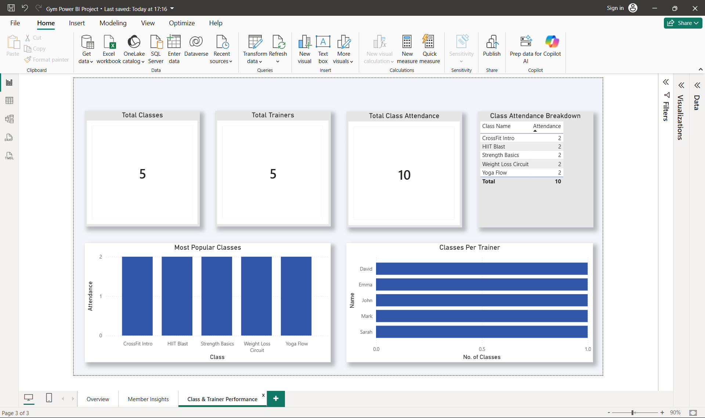

# Gym Management SQL Project

## Overview
This project is a relational database built using PostgreSQL to simulate a gym management system. It demonstrates database design, data modelling, and business analysis using SQL.

---

## Database Structure
- Members
- Trainers
- Classes
- Attendance
- Payments

Relationships:
- Trainers → Classes
- Members → Attendance → Classes
- Members → Payments

---

## Key Insights from SQL Analysis

### 1. Revenue Analysis
The project includes analysis of total revenue and breakdowns by payment method and membership type, providing insight into how income is generated.

### 2. Class Popularity
The most attended classes represent the highest demand and are identified using attendance counts grouped by class.

### 3. Member Engagement
Attendance tracking is used to identify highly active members, as well as members who have never attended a class.

### 4. Trainer Performance
Trainer activity is measured by the number of classes they deliver, highlighting workload distribution across staff.

### 5. Member Demographics
Age segmentation is used to group members into categories for better understanding of the gym’s customer base.

### 6. Revenue Trends
Monthly revenue analysis provides insight into financial performance over time.

---

## SQL Skills Demonstrated

This project includes practical use of:

- SELECT statements for data extraction
- INNER JOIN and LEFT JOIN for relational analysis
- GROUP BY for aggregations
- COUNT and SUM for KPI calculations
- HAVING clause for filtered aggregations
- CASE statements for data segmentation
- DATE_TRUNC for time-based analysis
- Business insight generation from raw data

---

## Business Questions Answered

Using SQL, the following questions were answered:

- What is the total revenue generated by the gym?
- Which payment methods generate the most revenue?
- Which membership types are most valuable?
- Which classes are most popular based on attendance?
- Which members are most and least active?
- Which trainers deliver the most classes?
- What does monthly revenue trend look like?
- How is the member base distributed by age group?
- Which members have never attended a class?
- Which members are the highest contributors financially?

---

## Tools Used

- PostgreSQL
- pgAdmin
- VS Code

## Power BI Dashboard Preview

### Overview Page

### Member Insights Page

### Class & Trainer Performance Page
